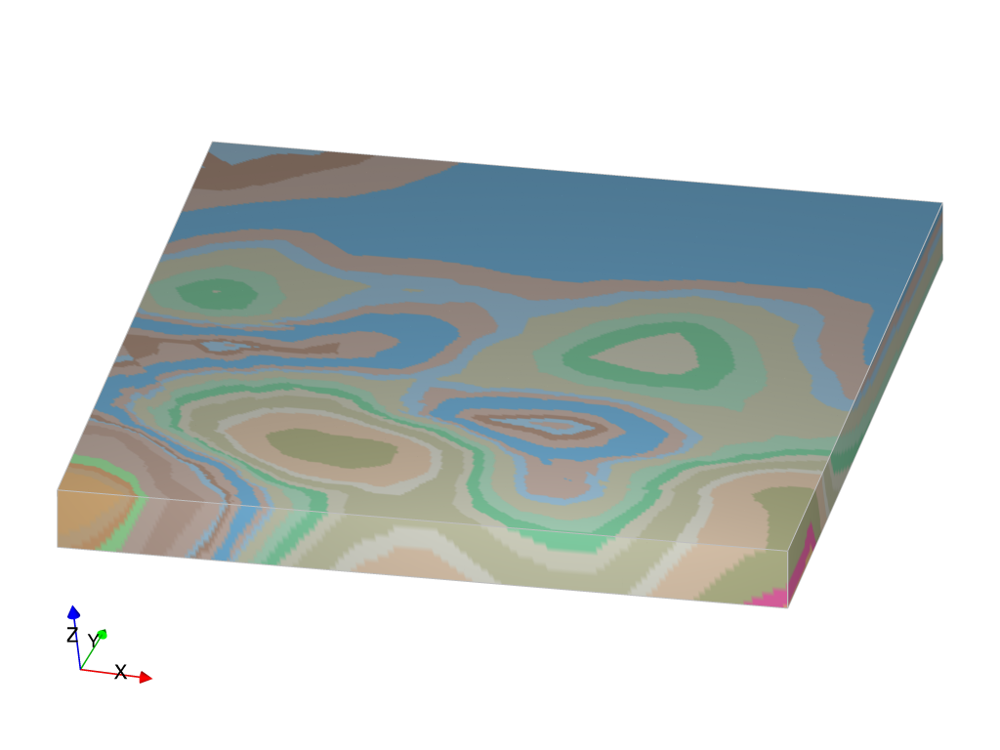

# LoopStructural: Loop3D Geological Forward Modeling Engine.

LoopStructural is the 3D geological modelling library for Loop ([Loop3d.org](https://loop3d.org/)). The development of LoopStructural is lead by **Lachlan Grose** as an ARC (LP170100985) post-doc at Monash University. **Laurent Ailleres** and **Gautier Laurent** have made significant contributions to the conceptual design and integration of geological concepts into the geological modelling workflow. **Roy Thomson** and **Yohan de Rose** have contributed to the implementation and integration of LoopStructural into the Loop workflow. 

Loop is led by Laurent Ailleres (Monash University) with a team of Work Package leaders from:
* Monash University: Roy Thomson, Lachlan Grose and Robin Armit
* University of Western Australia: Mark Jessell, Jeremie Giraud, Mark Lindsay and Guillaume Pirot
* Geological Survey of Canada: Boyan Brodaric and Eric de Kemp

The project benefits from in-kind contributions from the Geological Survey of Canada, the British Geological Survey, the French Bureau de Recherches Geologiques et Minieres, the RING group at the Universite de Lorraine, the RWTH in Aachen, Germany and AUSCOPE

* Python/cython implementation of a Discrete interpolatiors  
* Fold interpolation using constraints outlined in Laurent 2016 with fold geostatistical tools shown in Grose et al., 2017
* Fault interpolation 

If you want to use LoopStructural the easiest way to get started is to use a docker container and a jupyter notebook environment

1. Pull the loopstructural docker image `docker pull lachlangrose/loopstructural`
2. Start a docker container `docker run -it -p 8888:8888 lachlangrose/loopstructural`

## Documentation
The LoopStructural documentation can be found [here](https://loop3d.github.io/LoopStructural)
## Problems
Any bugs/feature requests/comments please create a new [issue](https://github.com/Loop3D/LoopStructural/issues). 

## Acknowledgements
*The Loop platform is an open source 3D probabilistic geological and geophysical modelling platform, initiated by Geoscience Australia and the OneGeology consortium. The project is funded by Australian territory, State and Federal Geological Surveys, the Australian Research Council and the MinEx Collaborative Research Centre.*
